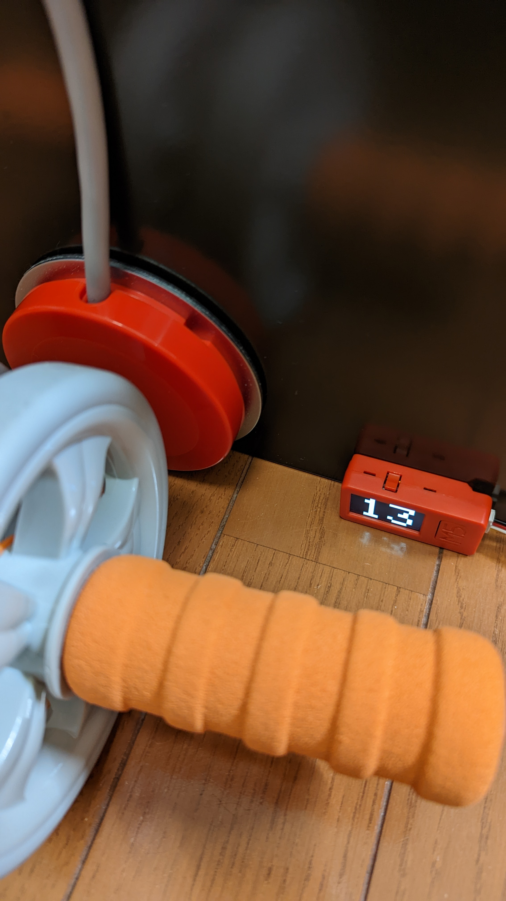
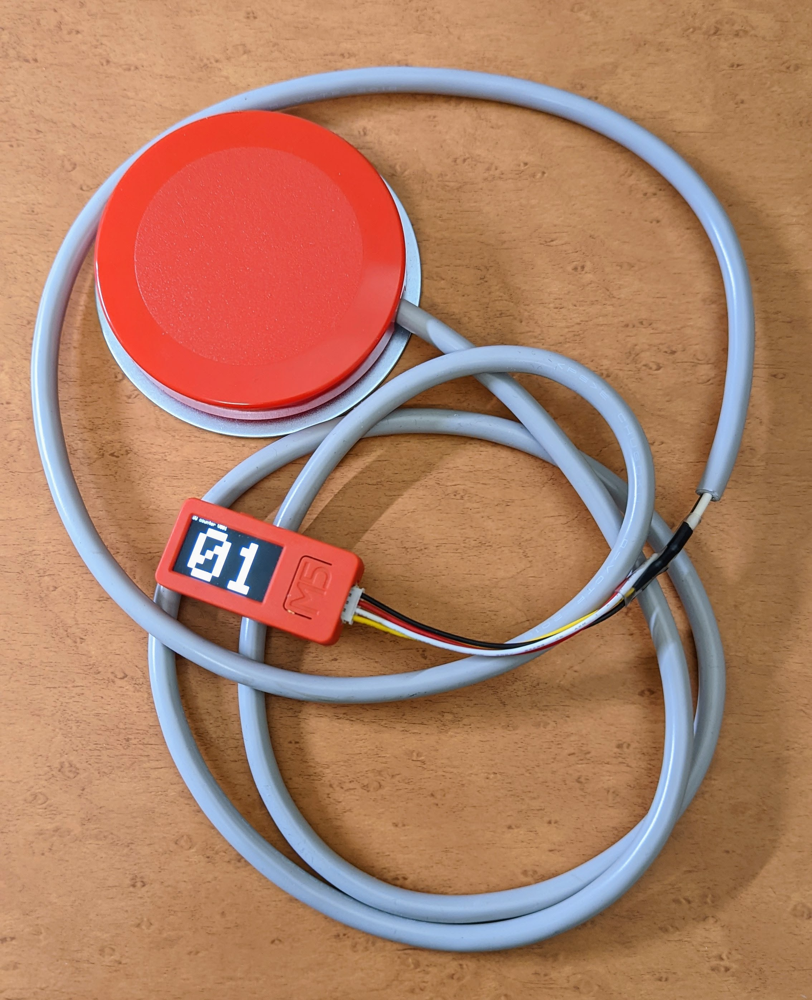
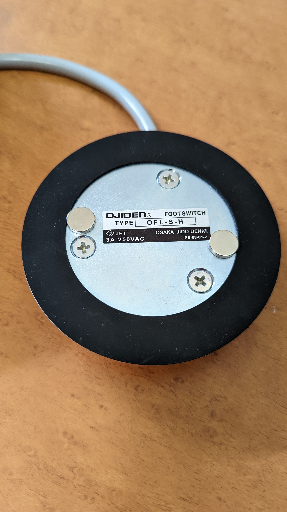

# RollerCounter

# About RollerCounter

スイッチのカウンター  
アブローラーで運動する時用に作成  

# Feature

-GROVEコネクタに接続したスイッチ入力のカウント
-5分間スイッチ入力無しでオートパワーオフ
-オートパワーオフ1分前にブザー
-スイッチは入力後3秒間は入力無効

ButtonBを押すと、GROVEコネクタのスイッチと同じ動作をする。

# Software

-Arduino 1.8.13
-LovyanGFX 0.4.18
-M5StickCPlus 0.0.8

Tool -> Board -> M5Stick-C-Plus

# Hardware

材料
 - [M5StickC Plus](https://docs.m5stack.com/en/core/m5stickc_plus)
 - [コネクタ付コード　４Ｐ　黒赤白黄　Ｇｒｏｖｅ用ケーブル](https://akizukidenshi.com/catalog/g/gC-16938/) 秋月電子 C-16938 GROVEケーブル
 - 熱収縮チューブ
 - [オジデン OFL-S-H](https://ojiden.co.jp/item/detail.html?itemId=I20130821003) フットスイッチ
 - ネオジム磁石

GROVEケーブルを半分に切って、1ピン(GND)と4ピン(SCL)をフットスイッチに配線する。

ネオジム磁石取付

# Licence

MIT License

Copyright (c) 2022 Suns & Moon Laboratory

Permission is hereby granted, free of charge, to any person obtaining a copy
of this software and associated documentation files (the "Software"), to deal
in the Software without restriction, including without limitation the rights
to use, copy, modify, merge, publish, distribute, sublicense, and/or sell
copies of the Software, and to permit persons to whom the Software is
furnished to do so, subject to the following conditions:

The above copyright notice and this permission notice shall be included in all
copies or substantial portions of the Software.

THE SOFTWARE IS PROVIDED "AS IS", WITHOUT WARRANTY OF ANY KIND, EXPRESS OR
IMPLIED, INCLUDING BUT NOT LIMITED TO THE WARRANTIES OF MERCHANTABILITY,
FITNESS FOR A PARTICULAR PURPOSE AND NONINFRINGEMENT. IN NO EVENT SHALL THE
AUTHORS OR COPYRIGHT HOLDERS BE LIABLE FOR ANY CLAIM, DAMAGES OR OTHER
LIABILITY, WHETHER IN AN ACTION OF CONTRACT, TORT OR OTHERWISE, ARISING FROM,
OUT OF OR IN CONNECTION WITH THE SOFTWARE OR THE USE OR OTHER DEALINGS IN THE
SOFTWARE.

# Link
[腹筋ローラー用カウンタ](https://www.s-m-l.org/m5cnt.html)

# Author

Suns & Moon Laboratory  
[https://www.s-m-l.org](https://www.s-m-l.org)
Twitter[@mikekoma](https://twitter.com/mikekoma)
